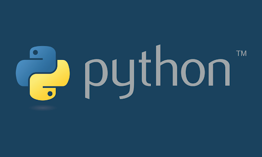

# SimplePySQLite
A python console script which performs basic SQL querys

---



---

### Builds
| Latest release | Latest development build |
|----------------|--------------------------|
| [](https://github.com/NotoFederico/SimplePySQLite/edit/main) | [](https://github.com/NotoFederico/SimplePySQLite/edit/dev) |

---

# Contents
- 1 - [Introduction](#1-introduction)
- 2 - [Building the application](#2-building-the-application)
  - 2.1 - [Building prerequisites](#21-building-prerequisites)
  - 2.2 - [Compiling and running](#22-compiling-and-running)
- 3 - [Contributing](#3-contributing)
- 4 - [Licence](#4-licence)

---

# 1. Introduction

A python console script which performs basic SQL querys

---

# 2. Building the application

## 2.1 Building prerequisites

**You need python for either operative system. Get it from https://www.python.org/downloads/**

### Windows
1. Clone the repository

### GNU/Linux
1. Clone the repository

---

## 2.2 Compiling and running

### Windows
1. Run cmd.exe
2. Use cd command to go to the local path folder where you cloned the repository
3. Execute python main.py

### GNU/Linux
1. Open a terminal in the local path folder where you cloned the repository
2. Execute python main.py

---

# 3. Contributing
SimplePyGUI Enhancer uses the [gitflow workflow](https://www.atlassian.com/git/tutorials/comparing-workflows#gitflow-workflow). If you are implementing a new feature or logic from the original game, please branch off and perform pull requests to ```develop```. If you are fixing a bug for the next release, please branch off and perform pull requests to the correct release branch. ```master``` only contains tagged releases, you should never branch off this.

---
# 4. Licence

SimplePyGUI is licensed under the GNU General Public License version 3.

